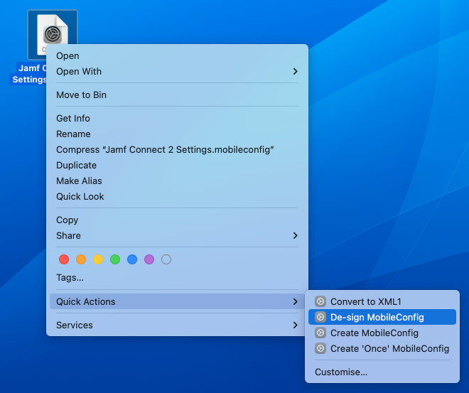

# MobileConfig Shortcuts for macOS

I love moof IT's [set of Automator services](https://github.com/moofit/mobileconfig_automator) which let me quickly un-sign configuration profiles I pull from Jamf, convert a binary plist to XML1 as well as integrating Tim Sutton's [mcxToProfile](https://github.com/timsutton/mcxToProfile/blob/master/mcxToProfile.py) to convert plists to mobileconfig.

Why convert these to Shortcuts? I could say it’s “_the way forward_” or “_modern_” but it comes down to laziness. Having these as Shortcuts means they automatically sync on all my work Macs requiring minimal setup.

The only caveat is the mcxToProfile-based Shortcuts. These require the PyObjC bindings and either Python 2 or Python 3 and the fork of `mcxToProfile.py` with Python 3 compatibility via [this repo](https://github.com/owenwater/mcxToProfile). I've pointed the python script to `/usr/local/bin` which can obviously be modified in the Shortcut.

Note: These are available when right-clicking a config/plist -> "Quick Actions" (you may have to click "Customize" to enable each).

## Shortcut Links

- [De-sign MobileConfig](https://www.icloud.com/shortcuts/bac8340b6883488587cb5df7d78e2a0b)
- [Convert to XML1](https://www.icloud.com/shortcuts/b12c500a13c74924b6ffaa1249651430)
- [Create MobileConfig](https://www.icloud.com/shortcuts/8f02d4098bcc4bb4a6b4b544d816b48d)
- [Create 'Once' MobileConfig](https://www.icloud.com/shortcuts/0850c427413c4d0b9eff054740e0a4ca)
